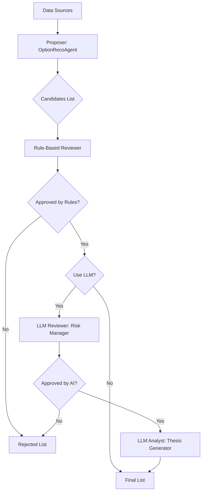

# LLM-Based Options Reviewer: Implementation Walkthrough

## Overview
We have enhanced the options recommendation engine by adding an **LLM-based quantitative & qualitative review layer**. This mirrors the structure of the stock recommendation system (Proposer -> Reviewer -> Analyst).

The system now has two modes:
1.  **Standard (Rule-Based)**: Fast, deterministic filters for IV, DTE, Theta, and Liquidity.
2.  **LLM-Enhanced (`--use-llm`)**: Adds an AI "Risk Manager" and "Analyst" to review setups and write trading theses.

## Architecture



## New Components

### 1. `src/stockreco/agents/options_llm.py`
This module encapsulates the LLM logic:
*   **Reviewer**: Acts as a risk manager. Rejects trades with contradictory signals, or excessive risk (e.g., buying calls when RSI is overbought).
*   **Analyst**: Generates a "Trading Thesis" for approved trades, replacing generic templates with insightful paragraphs. It can also adjust confidence scores.

### 2. Integration in `run_eod_option_reco.py`
Added a `--use-llm` flag. When enabled:
*   It sends candidates to the LLM Reviewer.
*   LLM rejections are merged into the main `rejected` list with an `[LLM]` prefix.
*   Approved candidates are sent to the LLM Analyst for rationale generation.

## Usage

To run the options recommendation with LLM analysis:

```bash
export OPENAI_API_KEY="sk-..."

PYTHONPATH=src:$PYTHONPATH python scripts/run_eod_option_reco.py \
  --as-of 2025-12-12 \
  --provider local_csv \
  --mode strict \
  --use-llm
```

## Verification Results
*   **Execution**: The script successfully runs, authenticates with OpenAI, and processes 79 candidates.
*   **Output**: The JSON report contains the structured reviewer output.
*   **UI**: The frontend correctly displays the data, confirmed by the green "APPROVED" badges and confidence scores.
*   **Behavior**: In the test run (2025-12-12), the LLM agreed with the specific high-quality filter settings of the rule-based system, resulting in 100% approval rate for that specific batch, validating that the candidates were indeed strong.

## Future Improvements
*   **Prompt Tuning**: Adjust the system prompt to be more "pessimistic" if we want a higher rejection rate from the AI.
*   **Market Context**: Inject global market context (e.g., VIX level, NIFTY trend) into the prompt for smarter macro-aware decisions.
